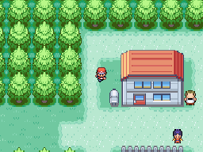

# Time of Day Introduction
This plugin is for Pokémon Essentials. It show time of day message and image (i.e. "Day", "Night").

## Screens

## Compatibility
Doesn't work on Essentials versions 18.1 and older.

## Installation
Follow FL's [Essentials plugin installation instructions](https://github.com/FL-/Misc/tree/main/Guides/EssentialsInstallPlugin).

## Notes
- The intro is displayed when player came outside and time was changed and when time change and player already is outside.
- This plugin come with day.png and night.png pictures at Graphics/Pictures/Time Intro. If you remove these images, the message will be centralized on a black background.
- You can change some constants in the script, like SHOW_AT_GAME_LOAD.

## Download

